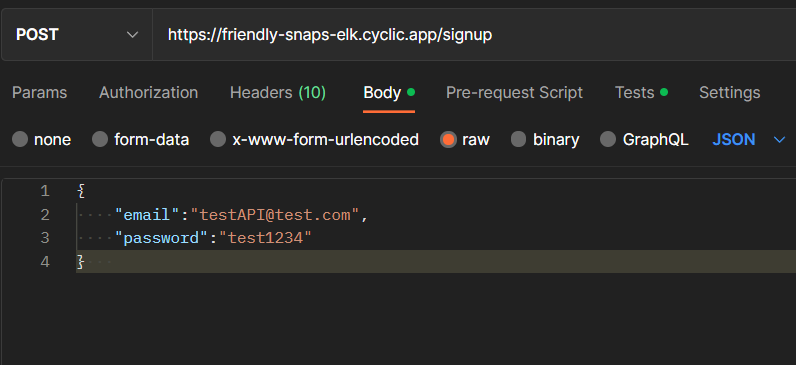
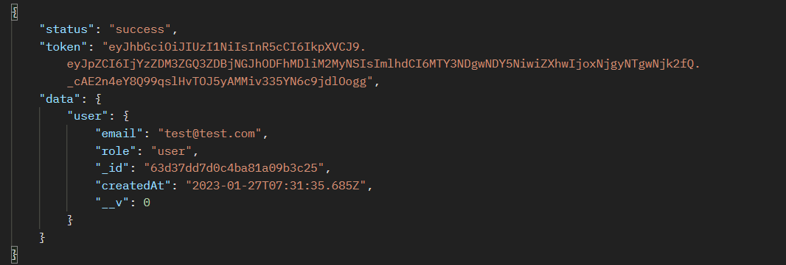
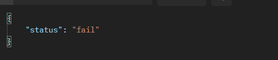
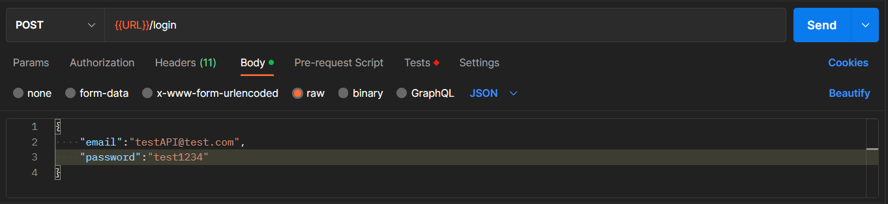
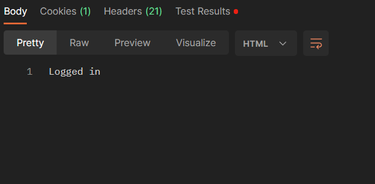
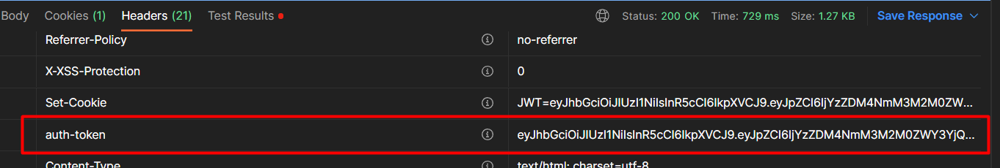
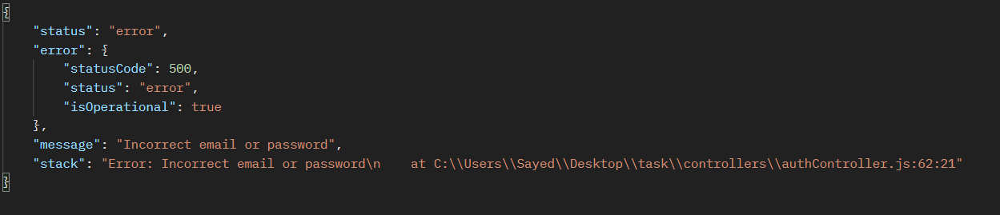
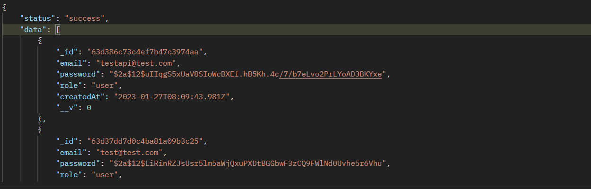
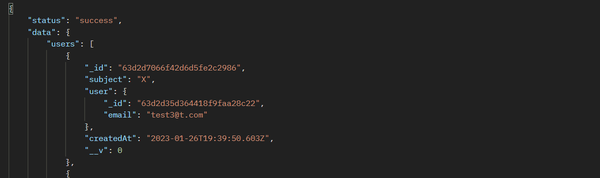

# Grade Tracker API

### Introduction

The GradeTracker API allows users to sign up, login, and submit grievances to an administrator. Administrators can also use the API to view all users and grievances on the system.

### Endpoints

### 1) Signup

-   <a href="#https://friendly-snaps-elk.cyclic.app/signup">https://friendly-snaps-elk.cyclic.app/signup</a>

-   Method: POST
-   Data:

-   Success Response:

    

-   Error Response:

    

### 2) Login

-   <a href="#https://friendly-snaps-elk.cyclic.app/login"> https://friendly-snaps-elk.cyclic.app/login</a>
-   Method: POST
-   Data:

-   Success Response:

    

-   Note: you will get the JWT token in the res.headers["auth-token"]

    

-   Error Response:

     

### 3) Do Grievance

-   <a href="#https://friendly-snaps-elk.cyclic.app/doGrievance"> https://friendly-snaps-elk.cyclic.app/doGrievance</a>
-   Method: POST
-   Data:

-   Success Response:

    

-   Error Response:

     

### 4) Get All Users

-   <a href="#https://friendly-snaps-elk.cyclic.app/getAllUsers">https://friendly-snaps-elk.cyclic.app/getAllUsers</a>

-   Method: GET
-   This request the admin only can use it

-   Success Response:

    

-   Error Response:

    

### 5) Get All Users Who Do Grievance

-   <a href="#https://friendly-snaps-elk.cyclic.app/grievance-users">https://friendly-snaps-elk.cyclic.app/grievance-users</a>

-   Method: GET
-   This request the admin only can use it

-   Success Response:

    

-   Error Response:

    
