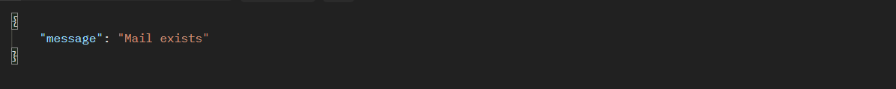

# Grade Tracker API

### Introduction

The GradeTracker API allows users to sign up, login, and submit grievances to an administrator. Administrators can also use the API to view all users and grievances on the system.

### Endpoints

### 1)Signup

URL: /signup
Method: POST
Auth required: No
Headers: Content-Type: application/json
Data:

-   Success Response:
    

-   Error Response:

    
